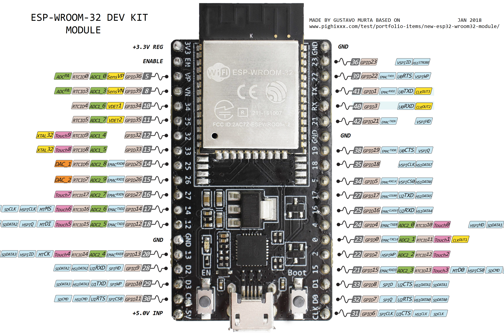
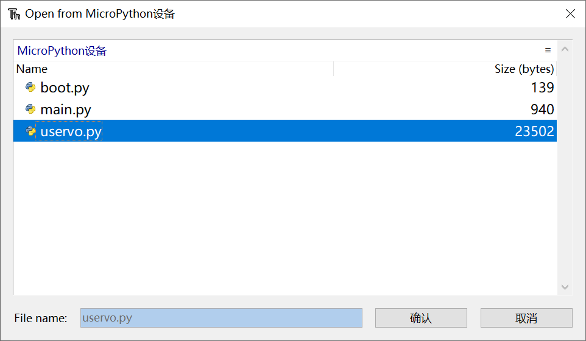
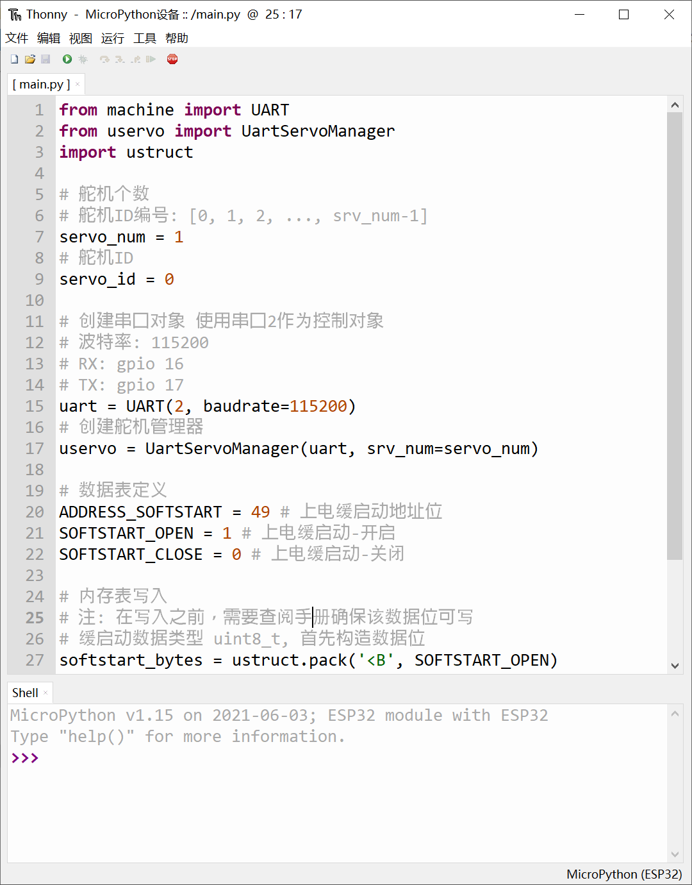

# 串口总线舵机SDK使用手册(MicroPython ESP32)


[toc]

作者: 阿凯|Kyle

邮箱: kyle.xing@fashionstar.com.hk

更新时间: 2021 / 06 / 04


## 硬件准备工作

### ESP32的串口资源

ESP32一共有三组UART资源

| 功能     | GPIO    |
| -------- | ------- |
| UART0 Tx | GPIO 1  |
| UART0 Rx | GPIO 3  |
| UART1 Tx | GPIO 10 |
| UART1 Rx | GPIO 9  |
| UART2 Tx | GPIO 17 |
| UART2 Rx | GPIO 16 |

我们使用ESP32的**UART2** 作为串口总线舵机的控制串口。

### ESP32与串口总线舵机转接板的接线

| ESP32              | 串口总线舵机转接板 | 备注 |
| ------------------ | ------------------ | ---- |
| GPIO 16 (UART2 Rx) | Tx                 |      |
| GPIO 17 (UART2 Tx) | Rx                 |      |
| VIN / 5V           | 5V                 | 可选 |
| GND                | GND                |      |

**注意事项**

* 使用时串口总线舵机转接板需要外接电源
* 开发的时候，如果ESP32与电脑相连， 则5V的接线可以不接


### NodeMCU32s



| 功能     | GPIO    | 板载标记 |
| -------- | ------- | -------- |
| UART0 Tx | GPIO 1  | TX       |
| UART0 Rx | GPIO 3  | RX       |
| UART1 Tx | GPIO 10 | D3       |
| UART1 Rx | GPIO 9  | D2       |
| UART2 Tx | GPIO 17 | 17       |
| UART2 Rx | GPIO 16 | 16       |

NodeMCU32s硬件资源详细介绍: [NodeMCU-32S 引脚说明书](http://www.1zlab.com/wiki/micropython-esp32/pins-and-gpio/#nodemcu-32s)

### M5Stack

> TODO


## 开发环境配置

在Win10下给ESP32烧录MicroPython的固件，以及用Thonny IDE 开发MicroPython的流程可以参考下面的文章：

[MicroPython-ESP32开发环境配置(Win10+Thonny IDE)](https://zhuanlan.zhihu.com/p/377519338)

注: Thonny IDE不是必须的，你可以使用其他IDE进行开发与脚本文件的上传.


## 安装串口总线舵机的库

在`src/` 文件夹下有一个`uservo.py` , 需要将其上传到ESP32 MicroPython文件系统的根目录里面。 




运行例程代码的方式也比较简单，`example/` 文件夹下的`.py` 文件拷贝到Thonny IDE代码编辑区， 保存为`main.py` 到ESP32文件系统即可。 




## 创建串口总线舵机管理器


使用的过程中一般需要导入如下这两个依赖

```python
# 串口总线通信
from machine import UART
# UartServoManager 是串口总线舵机管理器
from uservo import UartServoManager
```

配置参数

```python
# 舵机个数
# 注：舵机ID编号 假定是依次递增的
# 例: [0, 1, 2, ..., srv_num-1]
servo_num = 1
# 要测试的舵机ID
servo_id = 0
```


接下来要创建串口对象，指定相关的参数

```python
# 创建串口对象 使用串口2作为控制对象
# 波特率: 115200
# RX: gpio 16
# TX: gpio 17
uart = UART(2, baudrate=115200)
```

创建舵机管理器，将串口对象传入到构造器`UartServoManager`里面.

```python
# 创建舵机管理器
uservo = UartServoManager(uart, srv_num=servo_num)
```


## 舵机通信检测

### API-`ping` 

调用舵机的`ping()` 函数用于舵机的通信检测, 判断舵机是否在线.

**函数原型**

```python
def ping(self, servo_id:int):
```

**输入参数**

* `servo_id` : 舵机ID

**输出参数**

* `is_online` : 舵机是否在线


### 例程源码

`example/ping.py`

```python
'''
FashionStar Uart舵机 
> Python SDK舵机通讯检测 Example <
--------------------------------------------------
- 作者: 阿凯
- Email: kyle.xing@fashionstar.com.hk
- 更新时间: 2021-06-04
--------------------------------------------------
'''
from machine import UART
from uservo import UartServoManager

# 舵机个数
# 注：舵机ID编号 假定是依次递增的
# 例: [0, 1, 2, ..., srv_num-1]
servo_num = 1
# 要测试的舵机ID
servo_id = 0

# 创建串口对象 使用串口2作为控制对象
# 波特率: 115200
# RX: gpio 16
# TX: gpio 17
uart = UART(2, baudrate=115200)
# 创建舵机管理器
uservo = UartServoManager(uart, srv_num=servo_num)

# 舵机通讯检测
is_online = uservo.ping(servo_id)
print("舵机ID={} 是否在线: {}".format(servo_id, is_online))

```


## 舵机阻尼模式

### API-`set_damping` 

设置舵机为阻尼模式.

**函数原型**

```python
def set_damping(self, servo_id, power=0):
```

**输入参数**

* `servo_id`: 舵机ID
* `power`: 舵机功率，单位mW

**输出参数**

* 无


### 例程源码

```python
'''
FashionStar Uart舵机 
> Python SDK 舵机阻尼模式 <
--------------------------------------------------
- 作者: 阿凯
- Email: kyle.xing@fashionstar.com.hk
- 更新时间: 2021-06-04
--------------------------------------------------
'''
from machine import UART
from uservo import UartServoManager

# 舵机个数
# 注：舵机ID编号 假定是依次递增的
# 例: [0, 1, 2, ..., srv_num-1]
servo_num = 1
# 要测试的舵机ID
servo_id = 0

# 创建串口对象 使用串口2作为控制对象
# 波特率: 115200
# RX: gpio 16
# TX: gpio 17
uart = UART(2, baudrate=115200)
# 创建舵机管理器
uservo = UartServoManager(uart, srv_num=servo_num)

# 测试舵机为阻尼模式
power = 1000 # 阻尼模式下的功率, 单位mW
uservo.set_damping(servo_id, power)
```


## 舵机角度查询

### API-`query_servo_angle` 

**函数原型**

```python
def query_servo_angle(self, servo_id):
```

**输入参数**

* `servo_id`: 舵机ID

**输出参数**

* `angle` : 舵机角度(单圈/多圈）

**注意事项**

注意这里返回的角度是多圈模式的角度还是单圈模式的角度，取决于上次控制舵机的角度的指令是单圈模式还是/多圈模式， 默认为单圈。 

如果想人为的设定查询多圈/单圈，可以在查询之前设定`uservo.servos[servo_id].is_mturn` 这个布尔值。 

* `is_mturn=True` : 返回多圈角度
* `is_mturn=False`: 返回单圈角度


### 例程源码

设置舵机为阻尼模式，转动舵机 1s打印一下当前的角度

`example/query_servo_angle.py`

```python
'''
FashionStar Uart舵机 
> Python SDK舵机角度查询 Example <
--------------------------------------------------
- 作者: 阿凯
- Email: kyle.xing@fashionstar.com.hk
- 更新时间: 2021-06-04
--------------------------------------------------
'''
from machine import UART
from uservo import UartServoManager
import time

# 舵机个数
# 注：舵机ID编号 假定是依次递增的
# 例: [0, 1, 2, ..., srv_num-1]
servo_num = 1
# 要测试的舵机ID
servo_id = 0

# 创建串口对象 使用串口2作为控制对象
# 波特率: 115200
# RX: gpio 16
# TX: gpio 17
uart = UART(2, baudrate=115200)
# 创建舵机管理器
uservo = UartServoManager(uart, srv_num=servo_num)

# 设置舵机为阻尼模式
uservo.set_damping(servo_id, 500)

# 舵机角度查询
while True:
    angle = uservo.query_servo_angle(servo_id)
    print("当前舵机角度: {:4.1f} °".format(angle), end='\r')
    time.sleep(1)


```


## 设置舵机角度

### API-`set_servo_angle` 

设置舵机角度, 这个API包含了6种舵机角度控制模式，通过传入不同的参数 进而调用不同的指令. 具体的使用方式，可以参考**例程源码** 。

**函数原型**

```python
def set_servo_angle(self, servo_id:int, angle:float, is_mturn:bool=False, interval:float=None, velocity:float=None, t_acc:int=20, t_dec:int=20,  power:int=0, mean_dps:float=100.0):
```

**输入参数**

* `servo_id` : 舵机的ID号

* `angle`: 目标角度 
* `is_mturn`: 是否是多圈模式
* `interval `:  中间间隔 单位ms
* `velocity `: 舵机的目标转速, 单位dps
* `t_acc`: 加速时间，在指定目标转速时有效. 单位ms
* `t_dec`:  减速时间, 在指定减速时间时有效. 单位ms
* `power`: 功率限制, 单位mW
* `mean_dps`: 平均转速, 单位dps, 用于估计interval

**输出参数**

* 无

### API-`wait`  

等待所有的舵机到达目标角度

**函数原型**

```python
def wait(self, timeout=None):
```

**输入参数**

* `timeout`: 阻塞式等待的超时判断阈值，单位ms

**输出参数**

* 无


### 例程源码

```python
'''
FashionStar Uart舵机 
> 设置舵机角度 <
--------------------------------------------------
- 作者: 阿凯
- Email: kyle.xing@fashionstar.com.hk
- 更新时间: 2021-06-04
--------------------------------------------------
'''
from machine import UART
from uservo import UartServoManager
import time

# 舵机个数
# 舵机ID编号: [0, 1, 2, ..., srv_num-1]
servo_num = 1
# 舵机ID
servo_id = 0
# 舵机是否有多圈模式的功能
servo_has_mturn_func = False

# 创建串口对象 使用串口2作为控制对象
# 波特率: 115200
# RX: gpio 16
# TX: gpio 17
uart = UART(2, baudrate=115200)
# 创建舵机管理器
uservo = UartServoManager(uart, srv_num=servo_num)


print("[单圈模式]设置舵机角度为90.0°")
uservo.set_servo_angle(servo_id, 90.0, interval=0) # 设置舵机角度 极速模式
uservo.wait() # 等待舵机静止
print("-> {}".format(uservo.query_servo_angle(servo_id)))

print("[单圈模式]设置舵机角度为-80.0°, 周期1000ms")
uservo.set_servo_angle(servo_id, -80.0, interval=1000) # 设置舵机角度(指定周期 单位ms)
uservo.wait() # 等待舵机静止
print("-> {}".format(uservo.query_servo_angle(servo_id)))

print("[单圈模式]设置舵机角度为70.0°, 设置转速为200 °/s, 加速时间100ms, 减速时间100ms")
uservo.set_servo_angle(servo_id, 70.0, velocity=200.0, t_acc=100, t_dec=100) # 设置舵机角度(指定转速 单位°/s)
uservo.wait() # 等待舵机静止
print("-> {}".format(uservo.query_servo_angle(servo_id)))


print("[单圈模式]设置舵机角度为-90.0°, 添加功率限制")
uservo.set_servo_angle(servo_id, -90.0, power=400) # 设置舵机角度(指定功率 单位mW)
uservo.wait() # 等待舵机静止

#########################################################################################
if servo_has_mturn_func:
	print("[多圈模式]设置舵机角度为900.0°, 周期1000ms")
	uservo.set_servo_angle(servo_id, 900.0, interval=1000, is_mturn=True) # 设置舵机角度(指定周期 单位ms)
	uservo.wait() # 等待舵机静止
	print("-> {}".format(uservo.query_servo_angle(servo_id)))

	print("[多圈模式]设置舵机角度为-900.0°, 设置转速为200 °/s")
	uservo.set_servo_angle(servo_id, -900.0, velocity=200.0, t_acc=100, t_dec=100, is_mturn=True) # 设置舵机角度(指定转速 单位°/s) dps: degree per second
	uservo.wait() # 等待舵机静止
	print("-> {}".format(uservo.query_servo_angle(servo_id)))

	print("[多圈模式]设置舵机角度为-850.0°, 添加功率限制")
	uservo.set_servo_angle(servo_id, -850.0, power=400, is_mturn=True) # 设置舵机角度(指定功率 单位mW)
	uservo.wait() # 等待舵机静止
	print("-> {}".format(uservo.query_servo_angle(servo_id)))


```


##  轮式模式


### API-`wheel_stop`

轮式模式停止转动

**函数原型**

```python
def wheel_stop(self, servo_id):
```

**输入参数**

* `servo_id`: 舵机ID

**输出参数**

* 无

### API-`set_wheel_norm` 

设置轮子为普通模式, 转速单位: °/s

**函数原型**

```python
def set_wheel_norm(self, servo_id, is_cw=True, mean_dps=None)
```

**输入参数**

* `servo_id`: 舵机ID
* `is_cw`: 是否是顺时针
  * `True`: 顺时针
  * `False`: 逆时针
* `mean_dps`: 平均转速

**输出参数**

* 无


### API-`set_wheel_turn` 

轮式模式，让舵机旋转特定的圈数

**函数原型**

```python
def set_wheel_turn(self, servo_id, turn=1, is_cw=True, mean_dps=None, is_wait=True):
```

**输入参数**

* `servo_id` : 舵机ID
* `turn`: 目标要旋转的圈数
* `is_cw`: 旋转方向，是否为顺时针
  * `True`: 顺时针
  * `False`: 逆时针
* `mean_dps`: 平均转速
* `is_wait`: 是否是阻塞式等待

**输出参数**

* 无


### API-`set_wheel_time`

轮式模式，旋转特定的时间

**函数原型**

```python
def set_wheel_time(self, servo_id, interval=1000, is_cw=True, mean_dps=None, is_wait=True):
```

**输入参数**

* `servo_id` : 舵机ID
* `interval`: 目标要旋转的时间, 单位ms
* `is_cw`: 旋转方向，是否为顺时针
  * `True`: 顺时针
  * `False`: 逆时针
* `mean_dps`: 平均转速, 单位dps
* `is_wait`: 是否是阻塞式等待

**输出参数**

* 无

### 例程源码

`src/wheel.py`

```python
'''
FashionStar Uart舵机 
> Python SDK 舵机轮式模式测试 <
--------------------------------------------------
- 作者: 阿凯
- Email: kyle.xing@fashionstar.com.hk
- 更新时间: 2021-06-04
--------------------------------------------------
'''
from machine import UART
from uservo import UartServoManager
import time

# 舵机个数
# 舵机ID编号: [0, 1, 2, ..., srv_num-1]
servo_num = 1
# 舵机ID
servo_id = 0

# 创建串口对象 使用串口2作为控制对象
# 波特率: 115200
# RX: gpio 16
# TX: gpio 17
uart = UART(2, baudrate=115200)
# 创建舵机管理器
uservo = UartServoManager(uart, srv_num=servo_num)

print("测试常规模式")

# 设置舵机为轮式普通模式
# 旋转方向(is_cw) : 顺时针
# 角速度(mean_dps) : 单位°/s
uservo.set_wheel_norm(servo_id, is_cw=True, mean_dps=200.0)
# 延时5s然后关闭
time.sleep(5.0)

# 轮子停止
uservo.wheel_stop(servo_id)
time.sleep(1)

# 定圈模式
print("测试定圈模式")
uservo.set_wheel_turn(servo_id, turn=5, is_cw=False, mean_dps=200.0)

# 轮子定时模式
print("测试定时模式")
uservo.set_wheel_time(servo_id, interval=5000, is_cw=True, mean_dps=200.0)


```


## 用户配置表修改


### API-`reset_user_data`

重置用户数据表, 恢复默认值

**函数原型**

```python
def reset_user_data(self, servo_id):
```

**输入参数**

* `servo_id`: 舵机ID

**输出参数**

* 无

### API-`read_data` 

读取数据

**函数原型**

```python
def read_data(self, servo_id, address):
```


**输入参数**

* `servo_id`: 舵机ID
* `address`: 内存表

**输出参数**

* `content`: 数值的二进制数据流


### API-`write_data`

写入数据

**函数原型**

```python
def write_data(self, servo_id, address, content):
```

**输入参数**

* `servo_id`: 舵机ID
* `address`: 内存表
* `content`: 数值的二进制数据流

**输出参数**

* 无


### 例程源码-重置用户数据表

`example/reset_user_data.py`

```python
'''
FashionStar Uart舵机 
> 内存表数据重置 <

注意事项: 重置内存表这个指令比较特殊, 舵机ID也会被重置为0
因此测试该指令的时候, 最好只接一颗舵机。
--------------------------------------------------
- 作者: 阿凯
- Email: kyle.xing@fashionstar.com.hk
- 更新时间: 2021-06-04
--------------------------------------------------
'''
from machine import UART
from uservo import UartServoManager
import ustruct

# 舵机个数
# 注：舵机ID编号 假定是依次递增的
# 例: [0, 1, 2, ..., srv_num-1]
servo_num = 1
# 要测试的舵机ID
servo_id = 0

# 创建串口对象 使用串口2作为控制对象
# 波特率: 115200
# RX: gpio 16
# TX: gpio 17
uart = UART(2, baudrate=115200)
# 创建舵机管理器
uservo = UartServoManager(uart, srv_num=servo_num)

# 重置用户数据
uservo.reset_user_data(servo_id)

```


### 例程源码-读取内存表

`example/read_data.py`

```python
'''
FashionStar Uart舵机 
> 内存表数据读取 <
--------------------------------------------------
- 作者: 阿凯
- Email: kyle.xing@fashionstar.com.hk
- 更新时间: 2021-06-04
--------------------------------------------------
'''
from machine import UART
from uservo import UartServoManager
import ustruct

# 舵机个数
# 注：舵机ID编号 假定是依次递增的
# 例: [0, 1, 2, ..., srv_num-1]
servo_num = 1
# 要测试的舵机ID
servo_id = 0

# 创建串口对象 使用串口2作为控制对象
# 波特率: 115200
# RX: gpio 16
# TX: gpio 17
uart = UART(2, baudrate=115200)
# 创建舵机管理器
uservo = UartServoManager(uart, srv_num=servo_num)


# 数据表定义
ADDRESS_VOLTAGE = 1 # 总线电压值的地址

# 内存表读取
# 注: 因为每个数据位数据格式各不相同
# 因此读取得到的是字节流
voltage_bytes = uservo.read_data(servo_id, ADDRESS_VOLTAGE)

# 数据解析
# 电压的数据格式为uint16_t,单位: mV
# 关于struct的用法，请参阅官方手册: https://docs.python.org/3/library/struct.html
voltage = ustruct.unpack('<H', voltage_bytes)
print("总线电压 {} mV".format(voltage))


```


### 例程源码-写入内存表

`example/write_data.py`

```python
'''
FashionStar Uart舵机 
> 内存表数据写入 <
--------------------------------------------------
- 作者: 阿凯
- Email: kyle.xing@fashionstar.com.hk
- 更新时间: 2021-06-04
--------------------------------------------------
'''
from machine import UART
from uservo import UartServoManager
import ustruct

# 舵机个数
# 舵机ID编号: [0, 1, 2, ..., srv_num-1]
servo_num = 1
# 舵机ID
servo_id = 0

# 创建串口对象 使用串口2作为控制对象
# 波特率: 115200
# RX: gpio 16
# TX: gpio 17
uart = UART(2, baudrate=115200)
# 创建舵机管理器
uservo = UartServoManager(uart, srv_num=servo_num)

# 数据表定义
ADDRESS_SOFTSTART = 49 # 上电缓启动地址位
SOFTSTART_OPEN = 1 # 上电缓启动-开启
SOFTSTART_CLOSE = 0 # 上电缓启动-关闭

# 内存表写入
# 注: 在写入之前，需要查阅手册确保该数据位可写
# 缓启动数据类型 uint8_t, 首先构造数据位
softstart_bytes = ustruct.pack('<B', SOFTSTART_OPEN)
# 将数据写入内存表
ret = uservo.write_data(servo_id, ADDRESS_SOFTSTART, softstart_bytes)
# 打印日志
print("缓启动数据写入是否成功: {}".format(ret))


```


## 系统状态查询


### API-`query_voltage`

查询当前的电压

**函数原型**

```python
def query_voltage(self, servo_id)
```

**输入参数**

* `servo_id`: 舵机ID

**输出参数**

* `voltage`: 电压，单位V


### API-`query_current`

查询当前的电流

**函数原型**

```python
def query_current(self, servo_id):
```

**输入参数**

* `servo_id`: 舵机ID

**输出参数**

* `power`: 舵机电流，单位A


### API-`query_power`

查询当前的功率

**函数原型**

```python
def query_power(self, servo_id)
```

**输入参数**

* `servo_id`: 舵机ID

**输出参数**

* `power`: 舵机功率，单位W


### API-`query_temperature`

查询舵机当前的温度

**函数原型**

```python
def query_temperature(self, servo_id)
```

**输入参数**

* `servo_id`: 舵机ID

**输出参数**

* `temperature`: 温度， 单位 ℃


### 例程源码

`example/servo_status.py`

```python
'''
FashionStar Uart舵机 
> 读取舵机的状态信息 <
--------------------------------------------------
- 作者: 阿凯
- Email: kyle.xing@fashionstar.com.hk
- 更新时间: 2021-06-04
--------------------------------------------------
'''
from machine import UART
from uservo import UartServoManager
import time

# 舵机个数
# 舵机ID编号: [0, 1, 2, ..., srv_num-1]
servo_num = 1
# 舵机ID
servo_id = 0

# 创建串口对象 使用串口2作为控制对象
# 波特率: 115200
# RX: gpio 16
# TX: gpio 17
uart = UART(2, baudrate=115200)
# 创建舵机管理器
uservo = UartServoManager(uart, srv_num=servo_num)

def log_servo_status():
    '''打印舵机状态'''
    # 读取温度
    voltage = uservo.query_voltage(servo_id)
    # 读取电流
    current = uservo.query_current(servo_id)
    # 读取功率
    power = uservo.query_power(servo_id)
    # 读取温度
    temp = uservo.query_temperature(servo_id)

    print("Voltage: {:4.1f}V; Current: {:4.1f}A; Power: {:4.1f}W; T: {:2.0f}℃".format(\
        voltage, current, power, temp), end='\r')

while True:
    uservo.set_servo_angle(servo_id, 90)
    while not uservo.is_stop():
        log_servo_status()
        time.sleep(0.1)
    
    time.sleep(1)

    uservo.set_servo_angle(servo_id, -90)
    while not uservo.is_stop():
        log_servo_status()
        time.sleep(0.1)

    time.sleep(1)
```

